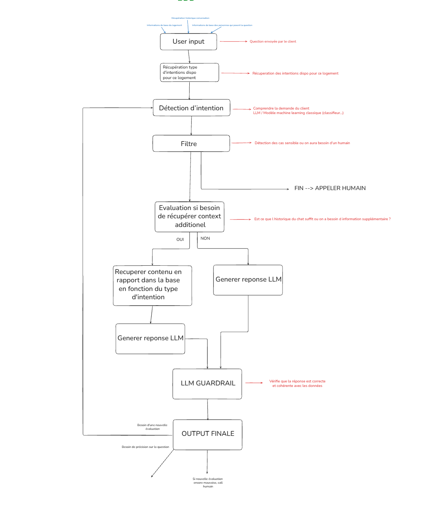
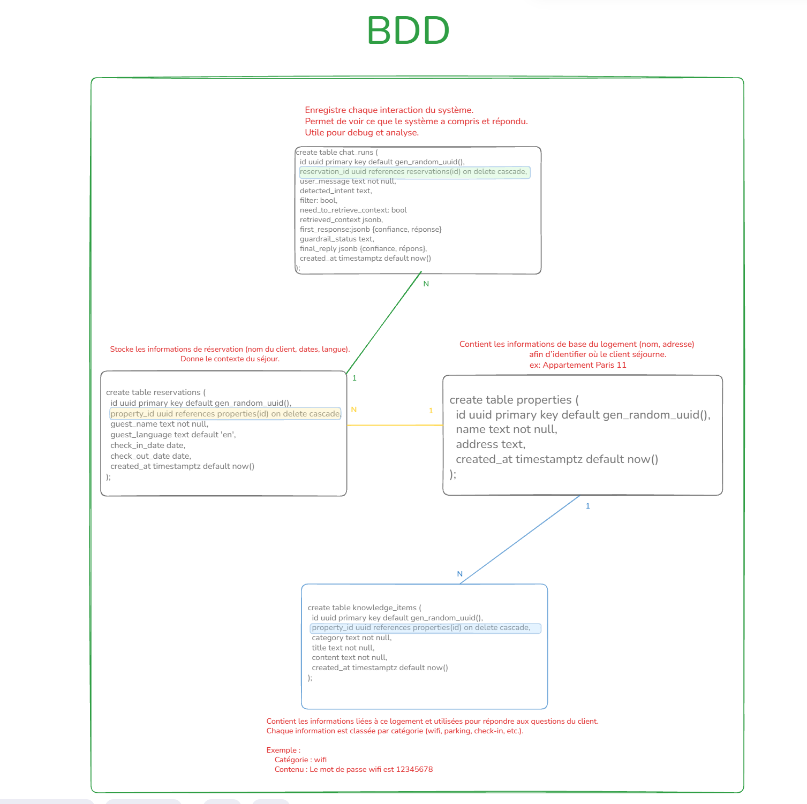
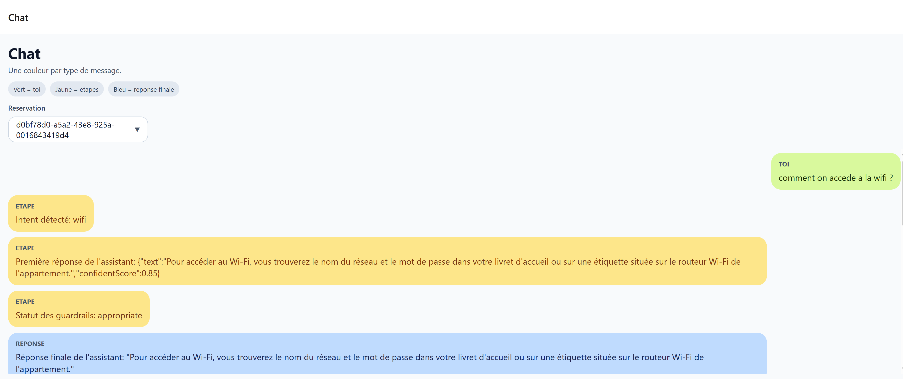

# React Chat Bot RAG Demo

This repository contains a small end-to-end demo of a chat assistant with:

- a `mobile` frontend built with Expo and React Native
- a `server` backend built with Bun, Hono, Drizzle, Supabase Postgres, and Gemini

The goal of the project is to simulate a reservation support assistant:

- the mobile app lets the user select a reservation and send messages
- the backend loads reservation context and conversation history
- a RAG-style pipeline classifies the intent, decides whether to filter to a human agent, optionally retrieves property knowledge, generates a response, runs guardrails, and stores the result in the database

## Repository Structure

```text
mobile/
  Expo + React Native app
  Main screen flow: app/index.tsx and app/chat.tsx

server/
  Bun + Hono API
  Drizzle schema and migrations
  Gemini-based RAG pipeline
```

## Main Flow

1. The mobile app loads reservations from the backend.
2. The user selects a reservation and sends a message.
3. The backend verifies the reservation exists.
4. The backend runs the RAG pipeline:
   - load reservation context and chat history
   - classify intent
   - decide whether human handoff is needed
   - optionally retrieve extra property context
   - generate a first response
   - run a guardrail check
   - save the run in the database
5. The mobile app reloads the conversation and displays the user message, intermediate steps, and final answer.



## Tech Stack

### Mobile

- Expo
- React Native
- Expo Router
- TypeScript

### Server

- Bun
- Hono
- Drizzle ORM
- Drizzle Kit
- Supabase Postgres
- Google Gemini API
- Zod

## Prerequisites

- Node.js and npm for the mobile app
- Bun for the server
- A Supabase project
- A Gemini API key

## Environment Variables

The backend expects a `server/.env` file.

At minimum:

```env
DATABASE_URL=postgresql://...
GEMINI_API_KEY=...
```

Depending on your local setup, you may also keep:

```env
SUPABASE_URL=...
SUPABASE_SERVICE_ROLE_KEY=...
```

## Database Setup

The database schema is defined in [server/db/schema.ts](server/db/schema.ts), and SQL migrations are generated in [server/drizzle](server/drizzle).

To apply the schema to your Supabase database:

```bash
cd server
bun install
bun run db:migrate
```

The current migrations also insert seed test data, so the database is initialized with sample reservations and chat-related records for development.

If you change the schema later:

```bash
cd server
bun run db:generate
bun run db:migrate
```



## Run The Project

### 1. Start the backend

```bash
cd server
bun install
bun run dev
```

The API runs on:

```text
http://localhost:3001
```

### 2. Start the mobile app

```bash
cd mobile
npm install
npx expo start
```

For web, Expo usually serves the app on:

```text
http://localhost:8081
```

## Important Dev Notes

- The frontend calls the backend on `localhost:3001`.
- When running the mobile app in the browser, CORS must be enabled on the server. This is already configured in the Hono app.
- The current chat UI loads reservation ids from the backend, lets the user pick one, and then loads the matching conversation history.

## UI Preview



## Useful API Routes

- `GET /health`
  Check that the backend is running.

- `GET /reservations/info`
  Return reservation ids and guest names.

- `GET /reservations/:id/conversation`
  Return the conversation history for one reservation.

- `POST /rag/newMessage`
  Send a new message for a reservation and trigger the RAG pipeline.

## Project Notes

- The mobile app currently focuses on a simple debugging-friendly chat interface.
- The backend contains the real business flow and database persistence.
- The RAG pipeline is implemented in [server/lib/ai/rag.ts](server/lib/ai/rag.ts).

## Additional Documentation

- Mobile details: [mobile/README.md](mobile/README.md)
- Server details: [server/README.md](server/README.md)
